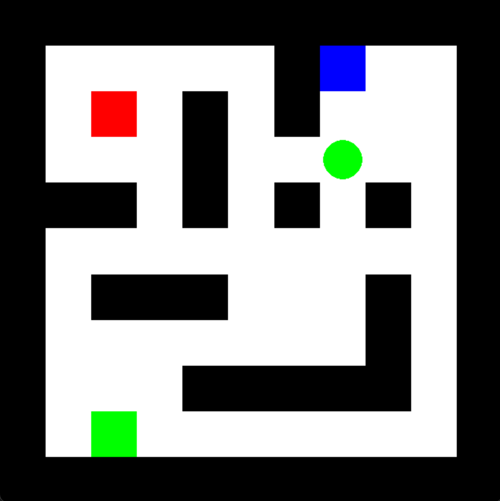
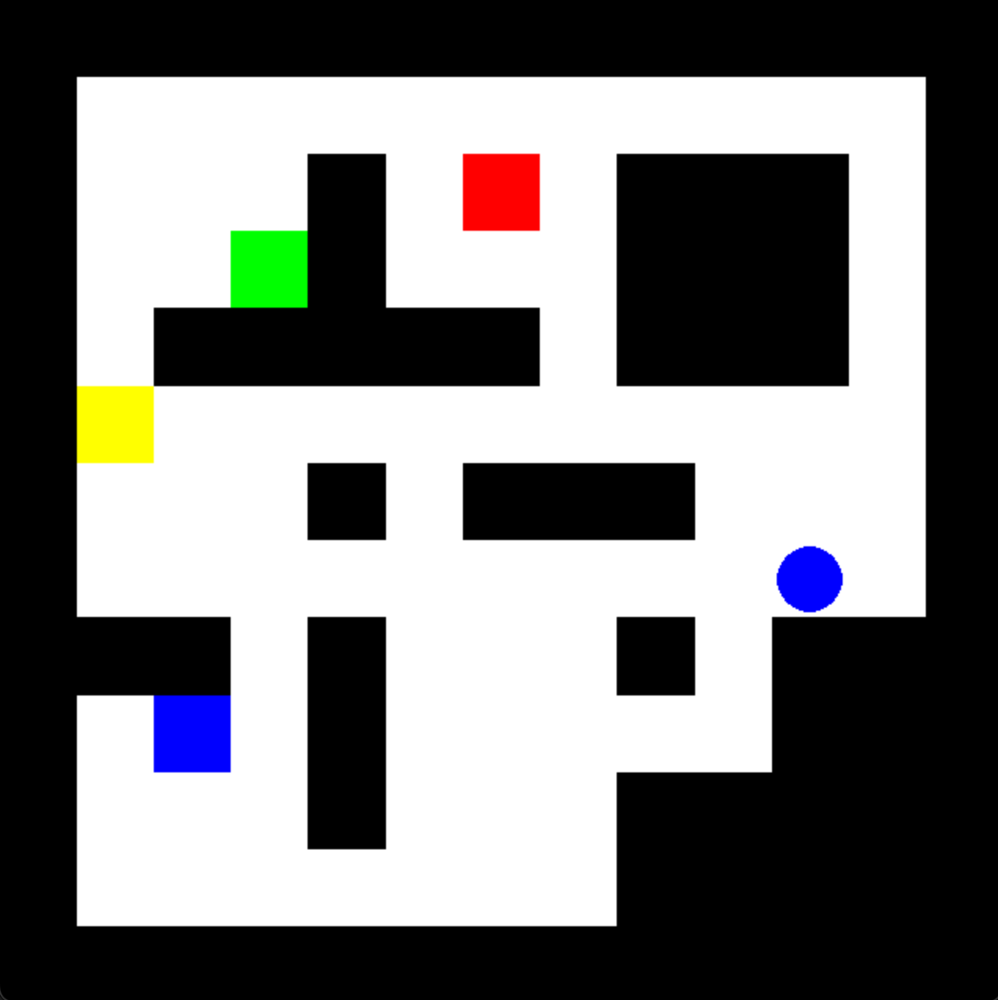
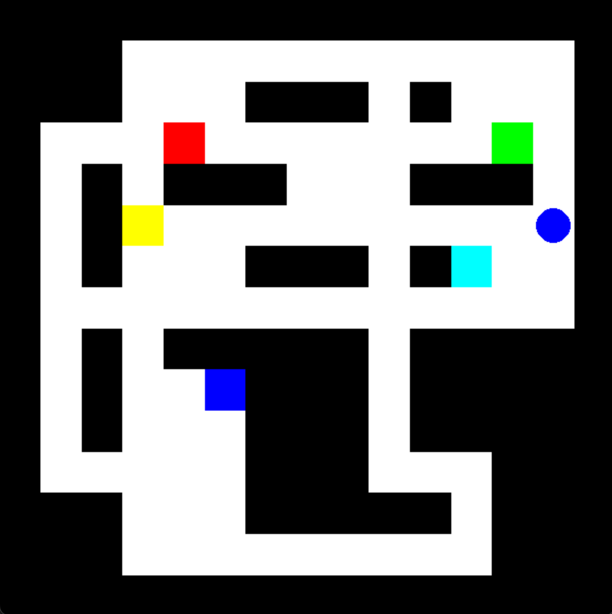
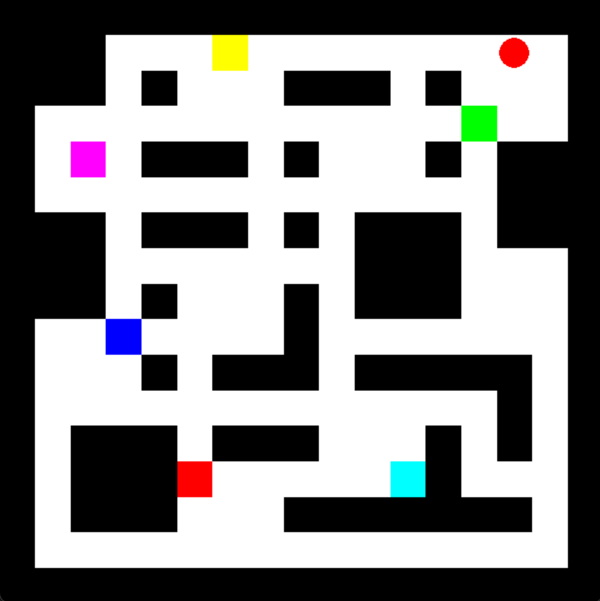
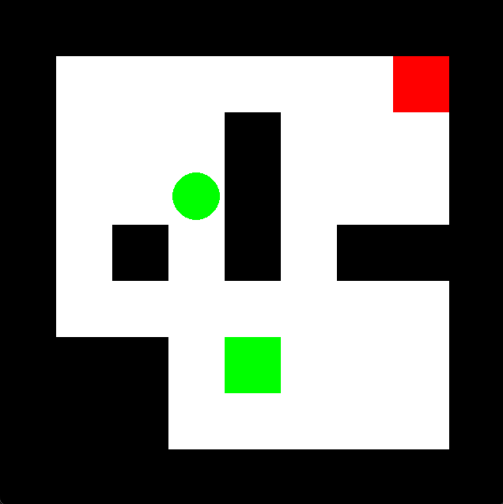
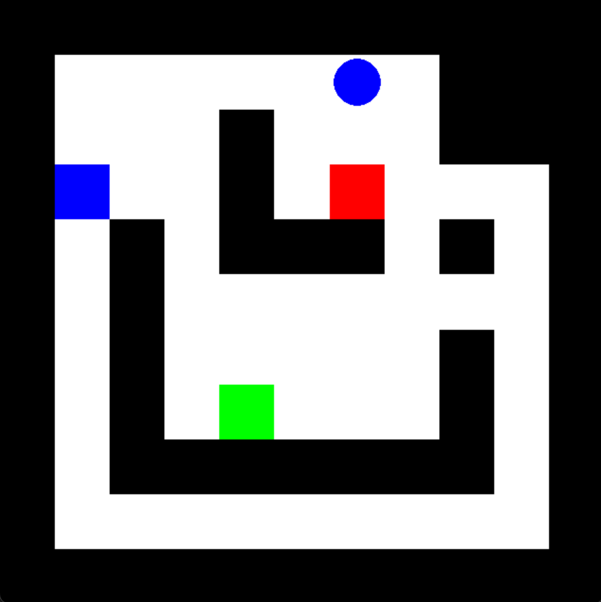
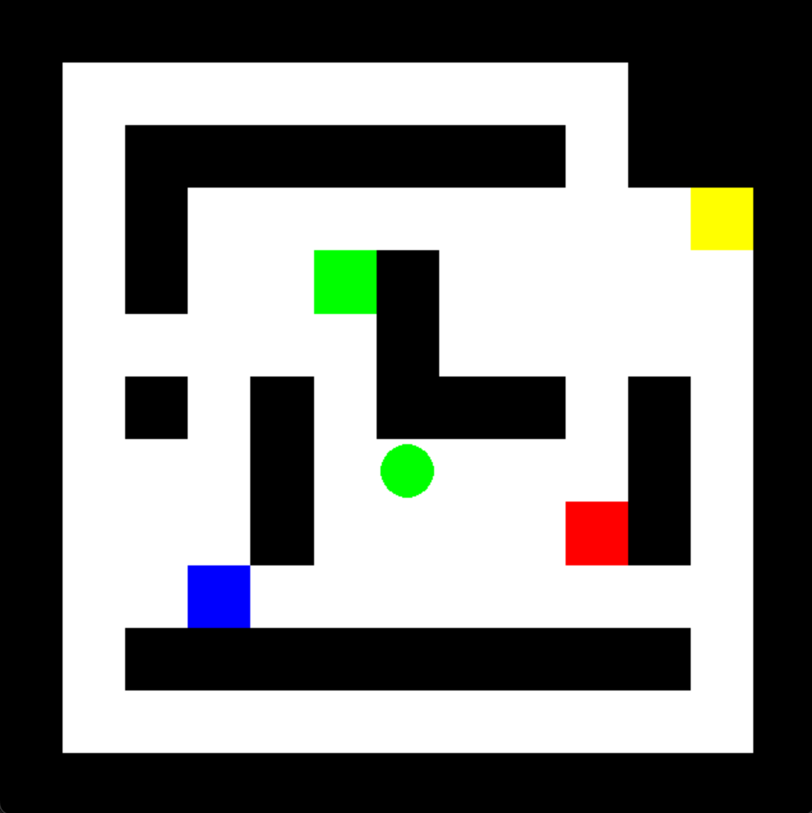
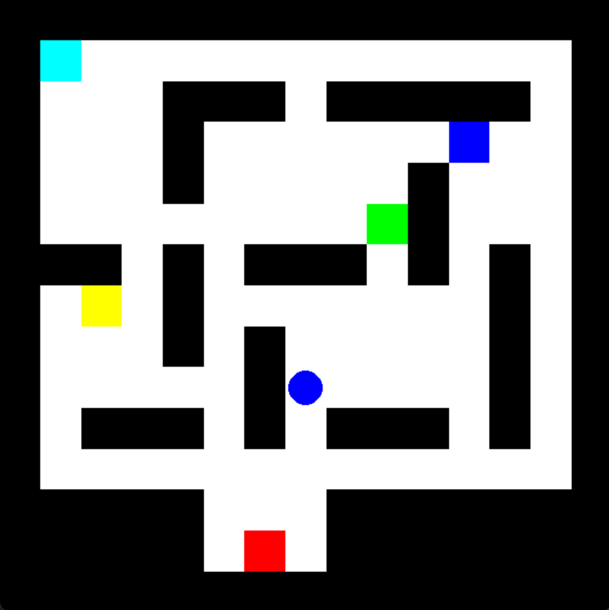
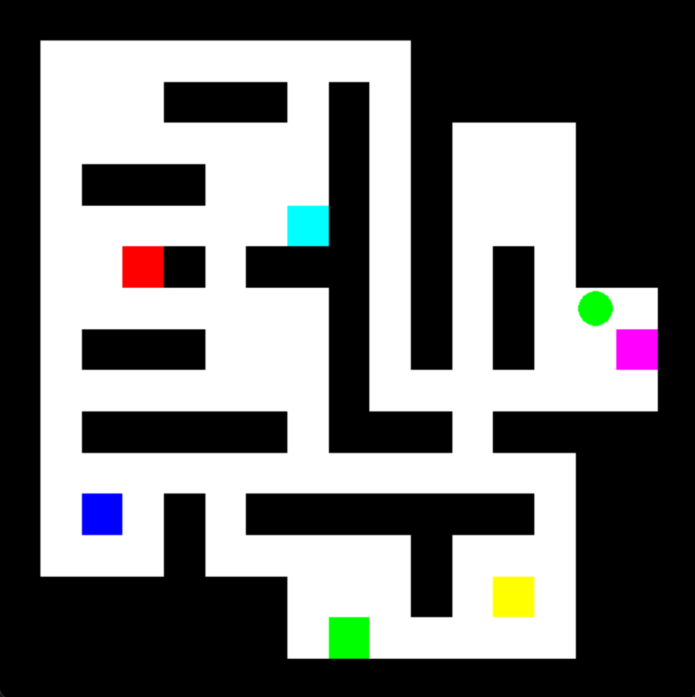

# Memory Grid 
Environment for testing the spatial memory of reinforcement learning agents. The Memory Grid is a discrete gridworld version of the [Memory Maze](https://github.com/jurgisp/memory-maze) by [Pasukonis et al. 2022](https://arxiv.org/abs/2210.13383). 

- Isolates long-range spatial memory component from confounding factors such as exploration, but also from continuous motion, and 3D egocentric perspective.
- Partial observability can be controlled by varying the agent's field of view


### Maze Types
- 7x7, 9x9, 11x11, 13x13, 15x15
in addition to the standard maze types, we also include a 7x7 maze with 2 goals 
- rest of parameters is the same as in the Memory Maze
- in contrast to the Memory Maze, we the Memory Grid is a discrete gridworld environment, rather than a continuous environment and is not 3D but 2D topview. Greatly simplified, reduces computational cost while still distilling the key feature of long-range spatial memory 
This environment is designed for memory tasks and features a 2D grid layout, as opposed to the 3D layout of the standard memory environment. The agent's observation is partial and egocentric, but from a topview perspective. Movement is restricted to discrete grid positions, rather than continuous motion.

| 7x7 | 9x9 | 11x11 | 13x13 | 15x15 |
|------------|--------------|--------------|--------------|--------------|
| 2 targets | 3 targets | 4 targets | 5 targets | 6 targets |
|  |  |  |  |  |
|  |  |  |  |  | 
- walls are black, empty cells white, the targets are square and have different colors
- the agent is round and has the color of the current target

The mazes are generated with [labmaze](https://github.com/deepmind/labmaze), the same algorithm as used by [DmLab-30](https://github.com/deepmind/lab/tree/master/game_scripts/levels/contributed/dmlab30). 

### Task: treasure hunt
- The agent is placed in a maze with a several targets of different color that do not change throughout an episode.
- The agent is prompted by a color and has to navigate to the corresponding target (given as part of observation).
- The agent receives a reward of +1 for reaching a target, after which a new target is chosen at random.
- Touching wrong targets and walls has no effect.
- The agent's observation is partial and egocentric, but from a topview perspective. Movement is restricted to discrete grid positions. Can move up, down, left, right.
- The episode ends after a fixed number of steps, total reward equals the number of targets reached.

Agents with long-range spatial memory should be able to remember the location of targets that are out of sight and navigate to them directly. Agents without long-range spatial memory have to explore the maze to find the target at random.

### Features

- Interactive GUI for human players.


## Installation
```
conda create -n grid python=3.11.3
conda activate grid
pip install -r requirements.txt
```	

## Usage 

### Play yourself 
You can play the Memory Grid yourself by running the following command:
```
python gui.py --size 9 --full_view --view_distance 2  --rand_name mxtoaos42
```
The `--size` argument specifies the size of the grid.
The `--full_view` argument specifies whether the agent can see the entire grid or only the cells in its field of view.
The `--view_distance` argument specifies the distance of the agent's field of view.
The `--rand_name` argument specifies a randomization for the maze. 'm' stands for maze, 't' for target, 'a' for agent, 's' for seed, '42' for the seed value. The 'o/x' behind each letter (m/t/a) indicates if the entity is randomized, the 'x' stands for fixed, 'o' for random.

You can play the GUI from the perspective of an agent with limited field of view, or from the perspective of an omniscient agent with full view of the entire grid.


### Train an agent
- Create an environment with gym and initialize it

### TODO
- [ ] How to train a RL agent
- [ ] Include example code for PPO
- [ ] Run baseline experiments


- [ ] Refactor randomization
- [ ] Refactor GUI

- [ ] take out copied phrases from Memory Maze
